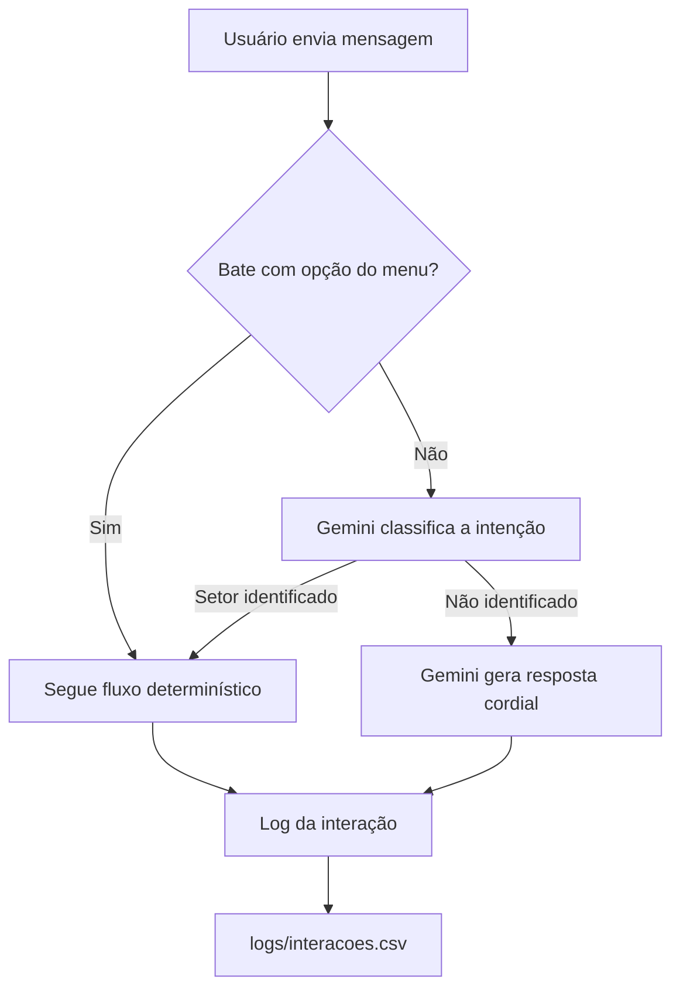

# Chatbot de Atendimento com Roteamento Híbrido (Regras + IA)

Case de um chatbot de atendimento no Telegram que combina um fluxo guiado por
menus com um agente de IA (Gemini) que assume quando o usuário sai do script
esperado — em vez de simplesmente responder "não entendi".

## 🎯 O problema

Chatbots de atendimento baseados só em botões funcionam bem enquanto o
usuário segue o roteiro. Na prática, as pessoas escrevem "queria saber sobre
o boleto" em vez de clicar em "Financeiro 💰" — e um bot 100% baseado em
`if/elif` de texto trava ou responde genérico nesses casos, gerando
frustração e, no mundo real, atendimentos perdidos.

## 🧠 A solução

Um bot híbrido:

1. **Fluxo determinístico** (`ConversationHandler` do `python-telegram-bot`)
   para os caminhos mais comuns — rápido, previsível e sem custo de API.
2. **Fallback com IA generativa (Gemini)** só quando o texto do usuário não
   bate com nenhuma opção esperada:
   - classifica a intenção em um dos setores conhecidos (financeiro, técnico,
     dúvidas) e redireciona automaticamente;
   - se não conseguir classificar, gera uma resposta cordial pedindo para
     escolher uma opção do menu, em vez de um "não entendi" seco;
   - ao escalar para um humano, gera um resumo de uma frase do pedido, para
     o atendente não precisar reler o histórico inteiro.
3. **Log estruturado** (`logs/interacoes.csv`) de cada interação relevante,
   incluindo quantas vezes o fallback de IA foi acionado — a base para uma
   futura análise de "onde o menu fixo está falhando".



## 🛠️ Stack

- **Python 3.11+**
- **python-telegram-bot** — framework de bot e máquina de estados da conversa
- **Gemini API** (`google-genai`) — classificação de intenção, respostas de
  fallback e resumo para atendente humano
- **python-dotenv** — configuração via `.env`
- **CSV** como camada simples de log/analytics (sem depender de banco de dados)

## 📂 Estrutura

```
.
├── bot.py              # Handlers e máquina de estados da conversa
├── ai_helper.py        # Integração com o Gemini (classificação, fallback, resumo)
├── registro.py         # Log das interações em CSV
├── requirements.txt
├── .env.example
└── logs/
    └── interacoes.csv  # Gerado automaticamente na primeira interação
```

## ▶️ Como rodar

```bash
git clone <url-do-repo>
cd chatbot-telegram
pip install -r requirements.txt
cp .env.example .env
# edite o .env com seu TELEGRAM_TOKEN e GEMINI_API_KEY
python bot.py
```

## 🧩 Decisões técnicas (e por quê)

- **Gemini em vez de outro provedor**: tier gratuito generoso o suficiente
  para um projeto de portfólio, sem necessidade de cartão de crédito.
- **IA só no fallback, não no fluxo principal**: mantém o caminho comum do
  atendimento rápido e sem depender de uma chamada de API — a IA entra
  exatamente onde ela agrega valor (interpretar texto livre), e não onde
  regras simples já resolvem.
- **Falha da IA nunca derruba o bot**: toda chamada ao Gemini tem tratamento
  de erro com resposta padrão, porque uma automação de atendimento não pode
  ficar fora do ar por causa de um rate limit da API.
- **Log em CSV, não em banco**: para o escopo do projeto, um CSV já permite
  abrir os dados no Excel/Sheets e responder perguntas como "quantos
  atendimentos caíram no fallback de IA esta semana" — sem a complexidade de
  configurar um banco de dados.

## 📈 Próximos passos

- Dashboard simples (Streamlit ou Google Sheets + gráfico) em cima do
  `interacoes.csv`, mostrando volume por setor e taxa de acionamento do
  fallback de IA.
- Persistir o histórico de conversa (hoje é só `context.user_data`, perdido
  ao reiniciar o bot).
- Testes unitários para as funções de classificação de setor.

## 🙋 Sobre este projeto

Construído como parte da minha transição de carreira para trabalhar
orquestrando ferramentas de IA na prática — não só usando IA generativa como
"assistente de texto", mas desenhando onde ela entra num sistema, onde ela
não deveria entrar, e como o sistema se comporta quando ela falha.